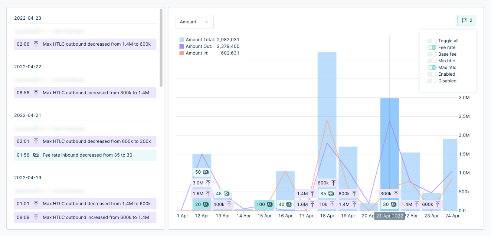
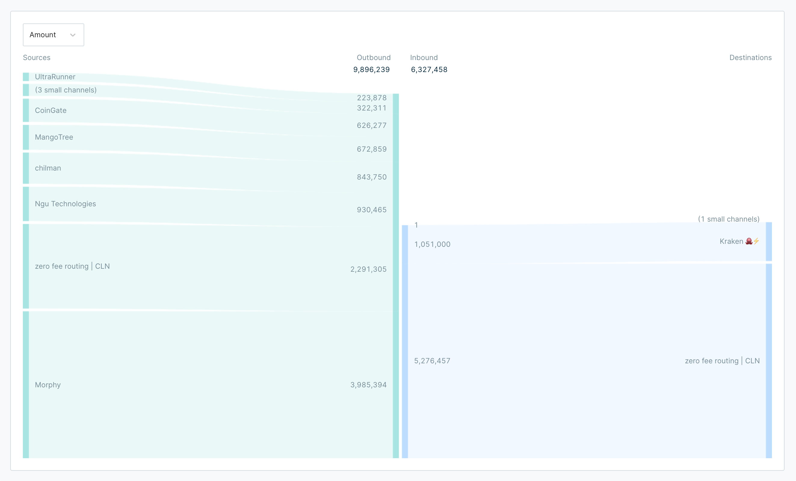
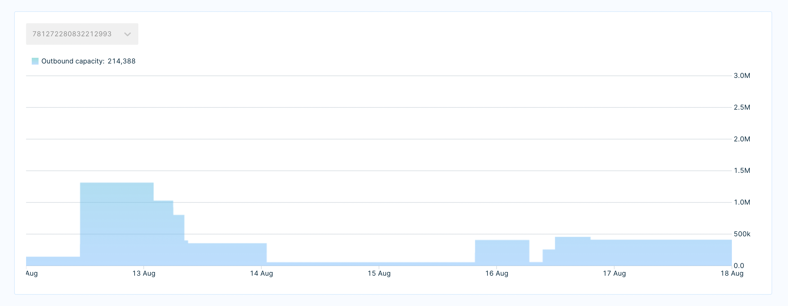
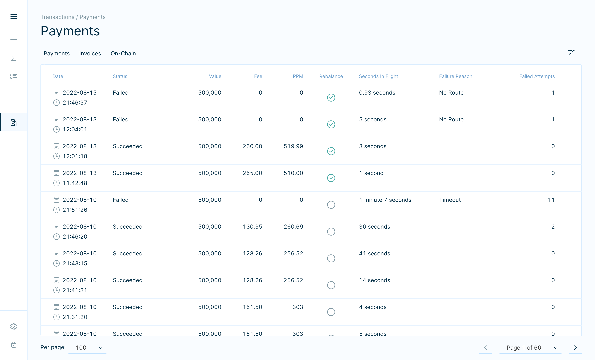

# Torq

Torq is a capital management tool for routing nodes on the lightning network.


## Quick start

To install Torq run:

```sh
sh -c "$(curl -fsSL https://torq.sh)"
```

You do not need sudo and you can check the contents of the installation script here: https://torq.sh

## Current features

- Channel and Channel group inspection
- See the channel balance (inbound/outbound capacity) over time.
- Advanced charts and visualizations of aggregated forwarding statistics.
- Visualization of sources and destinations for traffic.
- Stores all events from your node including HTLC events, fee rate changes and channel enable/disable events.
- Advanced filter, sort and group data
- Store filter, sort and group configurations to quickly find the right information.
- Fetch and analyse data from any point in time.
- Navigate through time (days, weeks, months) to track your progress.

### Features on the roadmap

- Support for CLN (C-lightning)
- Fee automation
- Automatic rebalancing based on advanced rules
- Limit HTLC amounts
- Automatic Backups
- Automatic channel tagging

### Permissions

Since Torq is built to manage your node, it needs most/all permissions to be fully functional.
This includes the ability to read and write to your node's configuration file.

If you want to be careful you can disable some permissions that are not strictly needed.

**NB: you sometimes need to restart Torq after updating the macaroon.
Wait until the save button in the UI is green before restarting Torq.**

Torq does not for now need the ability to create new macaroon, stop the LND daemon,

    lncli bakemacaroon \
        invoices:read \
        invoices:write \
        onchain:read \
        onchain:write \
        offchain:read \
        offchain:write \
        address:read \
        address:write \
        message:read \
        message:write \
        peers:read \
        peers:write \
        info:read \
        uri:/lnrpc.Lightning/UpdateChannelPolicy \
        --save_to=jack.macaroon

Here is an example of a macaroon that can be used if you want to limit actions that can send funds from your node:

    lncli bakemacaroon \
        invoices:read \
        invoices:write \
        onchain:read \
        offchain:read \
        address:read \
        address:write \
        message:read \
        message:write \
        peers:read \
        peers:write \
        info:read \
        uri:/lnrpc.Lightning/UpdateChannelPolicy \
        --save_to=jack.macaroon

## Join us!

Join our [Telegram group](https://t.me/joinchat/V-Dks6zjBK4xZWY0) for updates on releases
and feel free to ping us in the telegram group you have questions or need help getting started.
We would also love to hear your ideas for features or any other feedback you might have.

## Preview









